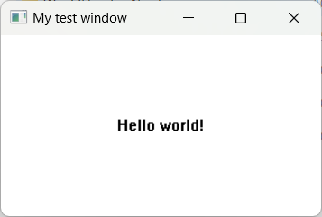
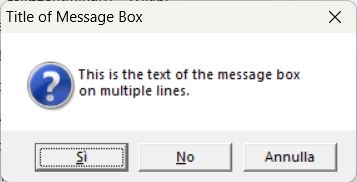
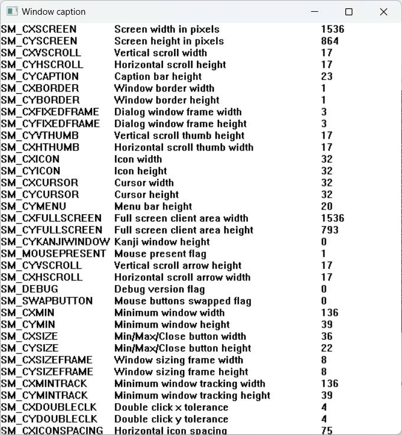

# NewlispWin32Api
Direct use of Win32 API from Newlisp (to create native GUIs and more...)

---

This project imports into the newlisp context `WIN32` the mappings for the Win32 native APIs, i.e. the functions and enumerations contained in the gdi32.dll, user32.dll and other DLLs of windows. You can find the bindings in the files under are cointained under [Win32HeadersNewlisp](Win32HeadersNewlisp).

To use the library is very simple, here is the example cointained in [MessageBox.nl](MessageBox.nl):
```
#!/bin/newlisp

(change-dir "Win32HeadersNewlisp")
(load "builtin.nl")
(load "main.nl")

(context 'WIN32)

(setq result
      (MessageBoxA 0
		   "This is the text of the message box\non multiple lines."
		   "Title of Message Box"
		   (| MB_YESNOCANCEL MB_ICONQUESTION)))

(print "Result: " result)

(exit)
```

You just need to import the main library files, change context and call the native windows APIs.

## Examples

I've included some example inspired from the book **Programming Windows** by **Charles Petzold** (1998) in the main project directory.

The examples can be simple executed with:
```
newlisp.exe Example.nl
```

Simple **CreateWindow** example [CreateWindow.nl](CreateWindow.nl):



A **MessageBox** example [MessageBox.nl](MessageBox.nl):



A window that displays all the **SystemMetrics** [DisplayAllSystemMetrics.nl](DisplayAllSystemMetrics.nl):



## TODO

* Finish to import the multimedia APIs and the 3D ones
* Add more examples
* Test more
